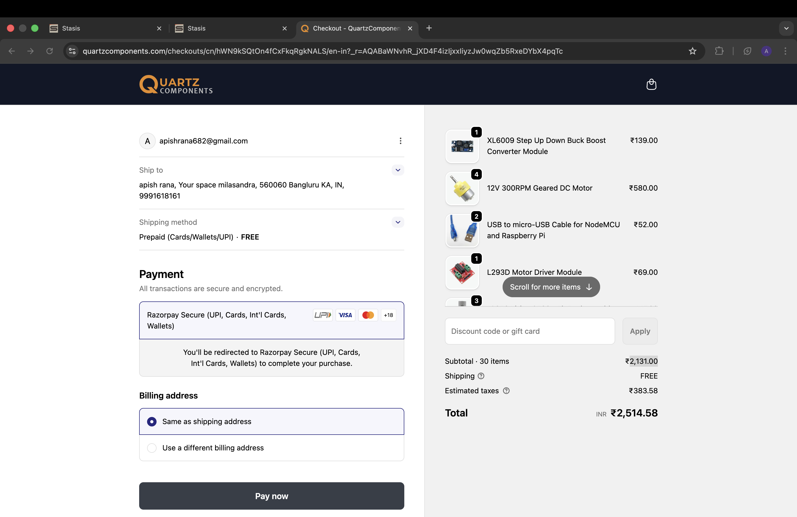

# ESP-NOW RC Car

## What This Project Is

This is a RC car built around two ESP32 boards. One ESP32 acts as the handheld controller and reads a joystick, and the second ESP32 sits on the car and drives the motors based on commands sent by second ESP32 using ESP-NOW protocol.

The current repository includes:

- ESP32 code for the [remote](src/car.txt) and the [car](./src/car.txt)
- A helper sketch for reading an ESP32 MAC address
- A [Fritzing](https://fritzing.org/) wiring design in `design.fzz`
- A Fusion360 design of car

## Why I Made It

The main goal was to learn how to use joystick input, ESP-NOW communication and motor control into one complete system that I could keep improving.

## Features

- ESP32-to-ESP32 wireless communication over ESP-NOW
- Joystick-based steering and drive input
- Simple motor driver control for forward, left, right, and stop states
- MAC address utility sketch to pair the boards

## How It Works

### Remote

The remote firmware is in [src/remote](/src/remote.txt). It:

- reads joystick X and Y values
- decides whether the car should stop, move, or turn
- sends the command over ESP-NOW to the car

### Car

The car firmware is in [src/car](src/car.txt). It:

- listens for incoming ESP-NOW packets
- decodes movement and reverse data
- controls four output pins connected to the motor driver to execute the commands

### MAC Address Utility

The helper sketch in [src/getMac](src/getMac.txt) prints the ESP32 MAC address so the remote can be paired with the car.

## Wiring

The current wiring diagram is stored as [design.fzz](design.fzz).

Main control connections used in firmware right now:

- Remote joystick Y-axis: GPIO 4
- Remote joystick X-axis: GPIO 2
- Car motor driver pins: GPIO 21, 19, 18, 5

## Build Photos

to be added latter

## 3D Model

the car 3d model can be found in [cad/](cad/)

### Side


### Front


### Top


### Bottom


## PCB

This project currently uses wiring-based electronics using a breadboard, not a PCB design.

## Repository Structure

```text
.
├── BOM.csv
├── cad
├── design.fzz
├── images
│   └── bill.png
├── include
│   └── README
├── JOURNAL.md
├── lib
│   └── README
├── platformio.ini
├── README.md
├── src
│   ├── car.txt
│   ├── getMac.txt
│   ├── main.cpp
│   └── remote.txt
└── test
    └── README
```

## How to setup your own car

- Paste the code form [getMac](src/getMac.txt) to `main.cpp` and upload to get mac of car ESP32
- Replace the placeholder broadcast MAC address in the [remote](src/remote.txt) firmware with the actual car ESP32 MAC address and upload the code through `main.cpp`
- Upload the [car](src/car.txt) code to car ESP32
- Replicate the wiring in [design.fzz](design.fzz)

## BOM

The full CSV BOM is in [BOM.csv](BOM.csv). Current estimated total: **2,131.00 + taxes => 2,514.58**.

